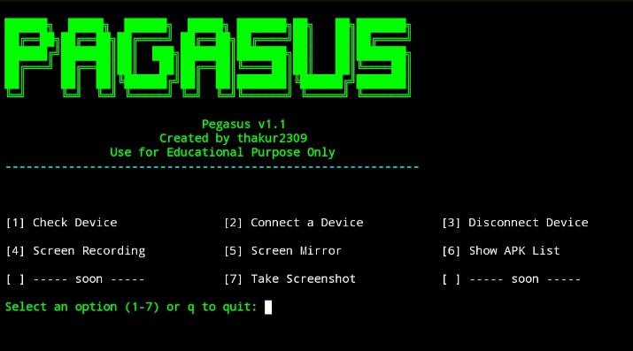
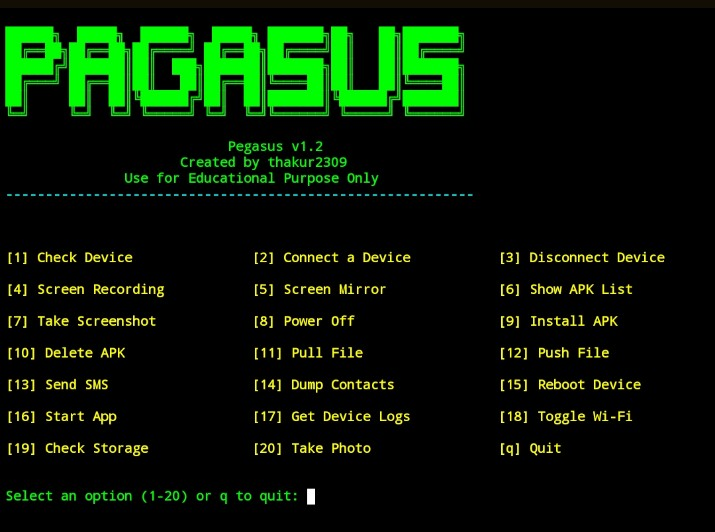

<div align="center">

```
██████╗ ███████╗ ██████╗  █████╗ ███████╗██╗   ██╗███████╗
██╔══██╗██╔════╝██╔════╝ ██╔══██╗██╔════╝██║   ██║██╔════╝
██████╔╝█████╗  ██║  ███╗███████║███████╗██║   ██║███████╗
██╔═══╝ ██╔══╝  ██║   ██║██╔══██║╚════██║██║   ██║╚════██║
██║     ███████╗╚██████╔╝██║  ██║███████║╚██████╔╝███████╗
╚═╝     ╚══════╝ ╚═════╝ ╚═╝  ╚═╝╚══════╝ ╚═════╝ ╚══════╝
```

# PEGASUS v1.3

**Android Device Management & Security Audit Tool**

[](https://python.org)
[](https://github.com/thakur2309/PAGASUS-PRO)
[](https://developer.android.com/tools/adb)
[](https://github.com/thakur2309/PAGASUS-PRO/releases)
[](./LICENSE)
[](https://github.com/thakur2309/PAGASUS-PRO/stargazers)

<br/>

> 🛡️ **For Educational & Personal Use Only**  
> Use only on devices you own or have explicit written permission to access.

<br/>

[Features](#-features) • [Screenshots](#-screenshots) • [Installation](#-installation) • [Usage](#-usage) • [Device Setup](#-android-device-setup) • [Changelog](#-changelog) • [License](#-license)

</div>

---
## 🗝️ Licence key
- 🔐 Licence key - `FIREWALLBREAKER`
- 📌 Instagram Username `sudo_xploit`
  
- 👉 [Instagram](https://www.instagram.com/sudo_xploit?igsh=MWN0YWc3N2JyenhoNw==)

---

## 📌 What is Pegasus?

**Pegasus** is a powerful Python-based Android Device Management and Security Audit tool built on top of **ADB (Android Debug Bridge)**. It provides an interactive, color-coded terminal menu to remotely manage, monitor, analyze, and audit Android devices — entirely from your PC, with no third-party app required on the phone.

### Who is it for?

| Audience | Use Case |
|----------|----------|
| 🧑‍💻 Android Developers | Quick device control and log monitoring during development |
| 🔐 Security Researchers | Audit and assess your own device's security posture |
| 🎓 Students | Learn Android internals, ADB commands, and mobile security |
| 🖥️ Power Users | Manage and control phones wirelessly over Wi-Fi |

---

## ✨ Features

### 📱 Device Management

| Option | Feature | Description |
|--------|---------|-------------|
| 1 | **Check Device** | View model name, Android version, and battery level |
| 2 | **Connect Device** | Connect via USB or wirelessly over Wi-Fi (TCP/IP) |
| 3 | **Disconnect Device** | Cleanly disconnect wireless ADB sessions |
| 4 | **Screen Recording** | Record device screen and auto-pull to your PC |
| 5 | **Screen Mirror** | Live real-time screen mirroring via `scrcpy` |
| 6 | **Show APK List** | List all installed packages, export clean list to file |
| 7 | **Take Screenshot** | Capture and pull screenshot instantly |
| 8 | **Power Off** | Remotely power off the device |
| 15 | **Reboot Device** | Remotely reboot the device |
| 18 | **Toggle Wi-Fi** | Enable or disable device Wi-Fi remotely |
| 19 | **Check Storage** | View storage usage in human-readable format |
| 20 | **Take Photo** | Trigger camera, capture photo, and auto-pull to PC |
| 21 | **Troubleshoot** | Kill and restart ADB server for connection issues |
| 23 | **Connection History** | View session connect/disconnect timestamps |

### 📦 App Management

| Option | Feature | Description |
|--------|---------|-------------|
| 9 | **Install APK** | Sideload and install any `.apk` from your PC |
| 10 | **Delete APK** | Uninstall any package by its package name |
| 16 | **Start App** | Launch any installed application remotely |

### 📂 File Transfer

| Option | Feature | Description |
|--------|---------|-------------|
| 11 | **Pull File** | Copy any file from device storage to PC |
| 12 | **Push File** | Copy any file from PC to device storage |

### 📋 Data & Logs

| Option | Feature | Description |
|--------|---------|-------------|
| 13 | **Send SMS** | Open SMS intent with pre-filled number and message |
| 14 | **Dump Contacts** | Extract contacts (Name + Number), save to `.txt` |
| 17 | **Get Device Logs** | Pull full `logcat` dump and save locally |

### 🔐 Advanced Security Audit *(Option 22)*

> Unlocks a dedicated penetration testing and security audit submenu.

| Sub-Option | Feature | Description |
|-----------|---------|-------------|
| 1 | **Root Detection** | Detect if device has been rooted via multiple methods |
| 2 | **APK Permissions Dump** | List all dangerous permissions granted per installed app |
| 3 | **Device Security Audit** | Check patch level, encryption state, and build tags |
| 4 | **Debuggable Apps Scanner** | Identify debug-enabled apps (common security risk) |
| 5 | **Interactive ADB Shell** | Open a live terminal shell session on the device |
| 6 | **Network Security Check** | Inspect Wi-Fi security type + optional `nmap` scan |
| 7 | **Dump SMS / Call Logs** | Export messages and call records to `.txt` files |
| 8 | **Security Log Filter** | Filter `logcat` for permission denials and security events |
| 9 | **Vulnerability Scanner** | Compare patch date against known risk threshold |
| 10 | **Network Connections Monitor** | View active network connections via `netstat` |

---

<div align="center">
  
## Main Menu — Pegasus v1.1
  


## Main Menu — Pegasus v1.2



## Main Menu — Pegasus v1.3


</div>

---

## 💻 Installation

### ⚡ One-Line Quick Install

| Platform | Command |
|----------|---------|
| **Ubuntu / Debian / Kali** | `sudo apt install -y python3 adb scrcpy git && git clone https://github.com/shopeebjm/PegasusPro.git && cd PegasusPro && python3 pegasus_v_1.3.py` |
| **Arch / Manjaro / BlackArch** | `sudo pacman -S python android-tools scrcpy git && git clone https://github.com/shopeebjm/PegasusPro.git && cd PegasusPro && python3 pegasus_v_1.3.py` |
| **macOS** | `brew install python android-platform-tools scrcpy git && git clone https://github.com/shopeebjm/PegasusPro.git && cd PegasusPro && python3 pegasus_v_1.3.py` |
| **Windows** | Install Python + ADB manually (see guide below), then: `git clone https://github.com/shopeebjm/PegasusPro.git && cd PegasusPro && python pegasus_v_1.3.py` |

---

### 🐧 Linux — Ubuntu / Debian / Kali

**Step 1 — Update system packages**
```bash
sudo apt update && sudo apt upgrade -y
```

**Step 2 — Install Python 3**
```bash
sudo apt install python3 python3-pip -y
```

**Step 3 — Install ADB**
```bash
sudo apt install adb -y
```

**Step 4 — Install scrcpy** *(optional — for Screen Mirror)*
```bash
sudo apt install scrcpy -y
```

**Step 5 — Install nmap** *(optional — for Network Security Scan)*
```bash
sudo apt install nmap -y
```

**Step 6 — Clone the repository**
```bash
git clone https://github.com/shopeebjm/PegasusPro
cd PegasusPro
```

**Step 7 — Run Pegasus v1.3**
```bash
python3 pegasus_v_1.3.py
```

> Want to run an older version?
> ```bash
> python3 pegasusV-1.2.py   # Run v1.2
> python3 pegasus_v1.1.py   # Run v1.1
> ```

---

### 🔷 Linux — Arch / Manjaro / BlackArch

**Step 1 — Update system**
```bash
sudo pacman -Syu
```

**Step 2 — Install Python and ADB**
```bash
sudo pacman -S python android-tools
```

**Step 3 — Install scrcpy** *(optional)*
```bash
sudo pacman -S scrcpy
```

**Step 4 — Install nmap** *(optional)*
```bash
sudo pacman -S nmap
```

**Step 5 — Clone the repository**
```bash
git clone https://github.com/shopeebjm/PegasusPro
cd PegasusPro
```

**Step 6 — Run Pegasus v1.3**
```bash
python3 pegasus_v_1.3.py
```

> Want to run an older version?
> ```bash
> python3 pegasusV-1.2.py   # Run v1.2
> python3 pegasus_v1.1.py   # Run v1.1
> ```

---

### 🪟 Windows 10 / 11

**Step 1 — Install Python 3**

1. Download from: https://www.python.org/downloads/
2. Run the installer
3. ✅ **Check "Add Python to PATH"** before clicking Install

Verify in Command Prompt:
```cmd
python --version
```

**Step 2 — Install ADB (Android Platform Tools)**

1. Download from: https://developer.android.com/tools/releases/platform-tools
2. Extract the `.zip` to a folder (e.g., `C:\platform-tools\`)
3. Add to Windows PATH:
   - Press `Win + S` → Search **"Environment Variables"**
   - Click **"Edit the system environment variables"**
   - Click **"Environment Variables"** → Under System Variables, select `Path` → **Edit**
   - Click **New** → Enter `C:\platform-tools`
   - Click **OK** on all windows

Verify:
```cmd
adb version
```

**Step 3 — Install scrcpy** *(optional)*

1. Download from: https://github.com/Genymobile/scrcpy/releases
2. Extract to a folder (e.g., `C:\scrcpy\`)
3. Add `C:\scrcpy\` to PATH using same method above

**Step 4 — Install Git** *(if not installed)*

Download from: https://git-scm.com/download/win → Install with default options

**Step 5 — Clone the repository**

Open **Command Prompt** or **PowerShell**:
```cmd
git clone https://github.com/shopeebjm/PegasusPro
cd PegasusPro
```

**Step 6 — Run Pegasus v1.3**
```cmd
python pegasus_v_1.3.py
```

> Want to run an older version?
> ```cmd
> python pegasusV-1.2.py   # Run v1.2
> python pegasus_v1.1.py   # Run v1.1
> ```

> 💡 **Tip:** Use **Windows Terminal** (free from Microsoft Store) for best color rendering.

---

### 🍎 macOS — Intel & Apple Silicon (M1/M2/M3)

**Step 1 — Install Homebrew** *(if not installed)*
```bash
/bin/bash -c "$(curl -fsSL https://raw.githubusercontent.com/Homebrew/install/HEAD/install.sh)"
```

**Step 2 — Install Python 3**
```bash
brew install python
```

Verify:
```bash
python3 --version
```

**Step 3 — Install ADB**
```bash
brew install android-platform-tools
```

Verify:
```bash
adb version
```

**Step 4 — Install scrcpy** *(optional)*
```bash
brew install scrcpy
```

**Step 5 — Install nmap** *(optional)*
```bash
brew install nmap
```

**Step 6 — Clone the repository**
```bash
git clone https://github.com/shopeebjm/PegasusPro
cd PegasusPro
```

**Step 7 — Run Pegasus v1.3**
```bash
python3 pegasus_v_1.3.py
```

> Want to run an older version?
> ```bash
> python3 pegasusV-1.2.py   # Run v1.2
> python3 pegasus_v1.1.py   # Run v1.1
> ```

---

## 📱 Android Device Setup

USB Debugging must be enabled on your Android device before Pegasus can connect.

### Enable USB Debugging

```
Settings → About Phone
→ Tap "Build Number" 7 times rapidly
→ "You are now a developer!" message appears
→ Go back → Settings → Developer Options
→ Toggle ON "USB Debugging"
→ Connect phone to PC via USB
→ On phone popup: tap "Allow"
```

### Switch to Wireless Mode (Wi-Fi ADB)

> One-time USB setup required. After that, go fully wireless.

1. Connect device via USB cable
2. Launch Pegasus → Select **`[2] Connect a Device`**
3. Enter `y` when asked to enable TCP/IP mode
4. Find your device IP: **Settings → Wi-Fi → Tap connected network → IP Address**
5. Enter the IP in Pegasus when prompted
6. Unplug USB — connection is now wireless ✅

---

## 🚀 Usage

```bash
# Linux / macOS — Latest Version
python3 pegasus_v_1.3.py

# Windows — Latest Version
python pegasus_v_1.3.py

# Run older versions
python3 pegasusV-1.2.py    # v1.2
python3 pegasus_v1.1.py    # v1.1
```

**Main Menu Preview:**

```
══════════════════════════════════════════════════════════════

[1] Check Device           [2] Connect a Device      [3] Disconnect Device

[4] Screen Recording       [5] Screen Mirror          [6] Show APK List

[7] Take Screenshot        [8] Power Off              [9] Install APK

[10] Delete APK            [11] Pull File             [12] Push File

[13] Send SMS              [14] Dump Contacts         [15] Reboot Device

[16] Start App             [17] Get Device Logs       [18] Toggle Wi-Fi

[19] Check Storage         [20] Take Photo            [q] Quit

[21] Troubleshoot Connection

[22] Unlock Advanced Security Tools

[23] View Device Connection History

══════════════════════════════════════════════════════════════
```

---

## 📂 Output Files

All generated files are saved in the **same directory** where you run the script.

| Filename | Generated By |
|----------|-------------|
| `screen.png` | Take Screenshot |
| `record.mp4` | Screen Recording |
| `apk_list.txt` | Show APK List |
| `contacts.txt` | Dump Contacts |
| `device_log.txt` | Get Device Logs |
| `storage_info.txt` | Check Storage |
| `sms_logs.txt` | Dump SMS (Security Tools) |
| `call_logs.txt` | Dump Call Logs (Security Tools) |
| `connection_log.txt` | Auto-generated connection session log |

---

## 📋 Dependency Summary

| Dependency | Required | Purpose | Install |
|-----------|----------|---------|---------|
| Python 3.7+ | ✅ Yes | Run the tool | `sudo apt install python3` |
| ADB | ✅ Yes | Device communication | `sudo apt install adb` |
| scrcpy | ⚪ Optional | Screen Mirror feature | `sudo apt install scrcpy` |
| nmap | ⚪ Optional | Network scan in Security Tools | `sudo apt install nmap` |
| Git | ⚪ Recommended | Clone the repository | `sudo apt install git` |

---

## 📁 File Reference

| File | Version | Run Command |
|------|---------|-------------|
| `pegasus_v_1.3.py` | v1.3 *(Latest)* | `python3 pegasus_v_1.3.py` |
| `pegasusV-1.2.py` | v1.2 | `python3 pegasusV-1.2.py` |
| `pegasus_v1.1.py` | v1.1 | `python3 pegasus_v1.1.py` |

---

## 📝 Catatan Perubahan
v1.3 - Rilis Terbaru

✅ Submenu Alat Keamanan Tingkat Lanjut ditambahkan (Opsi 22)
- 10 fitur:
+ Deteksi Root (multi-metode), Audit Izin APK, Audit Keamanan Lengkap
Pemindai Aplikasi yang Dapat Di-debug, Shell Interaktif, Pemeriksaan Keamanan Jaringan

- Pengumpulan Log SMS/Panggilan, Filter Log Keamanan, Pemindai Kerentanan, Pemantau Jaringan
- 
✅ Riwayat Koneksi Perangkat dengan stempel waktu dan durasi sesi (Opsi 23)

✅ Dukungan multi-perangkat
- daftar dan pilih saat beberapa perangkat terdeteksi
- 
✅ Pemutusan koneksi nirkabel selektif - pilih perangkat tertentu atau putuskan semua koneksi.

✅ Pemecahan Masalah ADB
- matikan/mulai ulang server ADB untuk memperbaiki koneksi yang macet (Opsi 21)
- 
✅ Peningkatan pada data kontak
- Name: Numberpenguraian format yang lebih bersih.
✅ Daftar APK yang lebih bersih
- hanya menampilkan nama paket, tanpa jalur mentah yang berantakan
- 
✅ Penyimpanan yang mudah dibaca manusia
- df -huntuk memudahkan pembacaan
- 
✅ Pencatatan koneksi otomatis
- log sesi ditulis saat dimulai dan diakhiri
v1.2 —pegasusV-1.2.py

✅ Menu utama diperluas menjadi 20 pilihan lengkap

✅ Matikan dan hidupkan ulang perangkat dari jarak jauh

✅ Instal APK (sideload) dan Hapus Instalasi

✅ Transfer dua arah (Dorong dan Tarik File)

✅ Kirim SMS melalui intent Android

✅ Buang kontak perangkat

✅ Logcat, hasil dump log perangkat

✅ Mengubah status Wi-Fi pada perangkat

✅ Pengecekan informasi penyimpanan

✅ Pemicu kamera jarak jauh dan pengambilan foto

✅ reModul ditambahkan untuk penguraian kontak
v1.1 —pegasus_v1.1.py

✅ Periksa info perangkat (model, versi Android, baterai)

✅ Koneksi dan pemutusan koneksi USB dan Wi-Fi ADB

✅ Perekaman layar dengan durasi yang dapat disesuaikan

✅ Pencermian layar langsung melalui scrcpy

✅ Daftar paket yang terpasang dan simpan ke file

✅ Ambil dan tarik tangkapan layar
v1.0

✅ Rilis awal
- pembungkus ADB dasar
- 
✅ Antarmuka pengguna menu terminal interaktif.

✅ Pemeriksa dependensi saat startup

✅ Output terminal berkode warna

---

## 📜 License

Proyek ini dilisensikan dibawah

**MIT License**.

```

Copyright (c) 2024 thakur2309

Permission is hereby granted, free of charge, to any person obtaining a copy
of this software and associated documentation files (the "Software"), to deal
in the Software without restriction, including without limitation the rights
to use, copy, modify, merge, publish, distribute, sublicense, and/or sell
copies of the Software, and to permit persons to whom the Software is
furnished to do so, subject to the following conditions:

The above copyright notice and this permission notice shall be included in all
copies or substantial portions of the Software.

THE SOFTWARE IS PROVIDED "AS IS", WITHOUT WARRANTY OF ANY KIND, EXPRESS OR
IMPLIED, INCLUDING BUT NOT LIMITED TO THE WARRANTIES OF MERCHANTABILITY,
FITNESS FOR A PARTICULAR PURPOSE AND NONINFRINGEMENT. IN NO EVENT SHALL THE
AUTHORS OR COPYRIGHT HOLDERS BE LIABLE FOR ANY CLAIM, DAMAGES OR OTHER
LIABILITY, WHETHER IN AN ACTION OF CONTRACT, TORT OR OTHERWISE, ARISING FROM,
OUT OF OR IN CONNECTION WITH THE SOFTWARE OR THE USE OR OTHER DEALINGS IN THE
SOFTWARE.
```

---

## ⚠️ Disclaimer
Pegasus dikembangkan khusus untuk penggunaan pendidikan dan pribadi.

✅ Gunakan alat ini hanya pada perangkat Android yang Anda miliki atau yang Anda miliki izin tertulis secara eksplisit untuk mengaksesnya.
❌ Akses tanpa izin ke perangkat orang lain adalah ilegal menurut hukum kejahatan siber dan privasi di seluruh dunia — termasuk Undang-Undang TI (India), CFAA (AS), Undang-Undang Penyalahgunaan Komputer (Inggris), dan undang-undang serupa di negara lain.
Pengembang ( shopeebjm ) tidak bertanggung jawab atas penggunaan perangkat lunak ini yang ilegal, tidak etis, atau tidak sah.
Semua fitur ekstraksi data (kontak, SMS, riwayat panggilan) ditujukan secara eksklusif untuk pencadangan data pribadi dan penelitian keamanan pada perangkat Anda sendiri .

---

## 🤝 Berkontribusi
- Kontribusi, laporan bug, dan saran fitur sangat kami harapkan!
Berkontribusi
Kontribusi, laporan bug, dan saran fitur sangat kami harapkan!

- Fork repositori ini
Buat cabang Anda:git checkout -b feature/your-feature-name
Simpan perubahan Anda:git commit -m "feat: add your feature"
Dorong ke cabang:git push origin feature/your-feature-name
Buka Permintaan Tarik (Pull Request)

---

## ⭐ Dukung Proyek ini

- Jika Pegasus membantu Anda, pertimbangkan untuk memberikan bintang ⭐ di GitHub.
- Ini membantu orang lain menemukan proyek ini dan memotivasi pengembangan berkelanjutan.

---

👨‍💻 **Author**  
- Made with ❤️ by **shopeebjm** 
- Name: **shopeebjm**  
- YouTube: [🔥 @shopee.bjm](https://www.tiktok.com/@shopee.bjm)

---
# Social Media

<h2 align="center">

[](https://shopee.co.id/infinixnote40bjm)

[](https://www.youtube.com/@shopee_banjarmasin)

[](https://www.instagram.com/shopee_banjarmasin)

[](https://www.twitter.com/kiplymacho)
  
[](https://www.tiktok.com/@shopee.bjm)

[](https://www.facebook.com/shopee.bjm)

[](http://t.me/shopeebjm)

[](http://www.linkedin.com/in/kiplymacho)

</p>
<div height='45' align="center">
<h2>Contact me: <br>
<a href="https://github.com/shopeebjm">  </a>
<a href="https://facebook.com/shopee.bjm">  </a>

<a href="https://paypal.me/kiplymacho">  </a>
</h2>
</div>

## Follow Me :

[](https://fb.me/shopee.bjm)
<a href="https://tiktok.com/@shopee.bjm"></a>
[](https://instagram.com/shopee_banjarmasin)
[](https://kiplymacho.blogspot.com)
[](https://facebook.com/shopee.bjm)
[](https://facebook.com/httpcustomkiplymacho)
[](https://wa.me/6285751032225)
[](https://t.me/shopeebjm)
<a href="https://youtube.com/@shopee_banjarmasin"></a>
